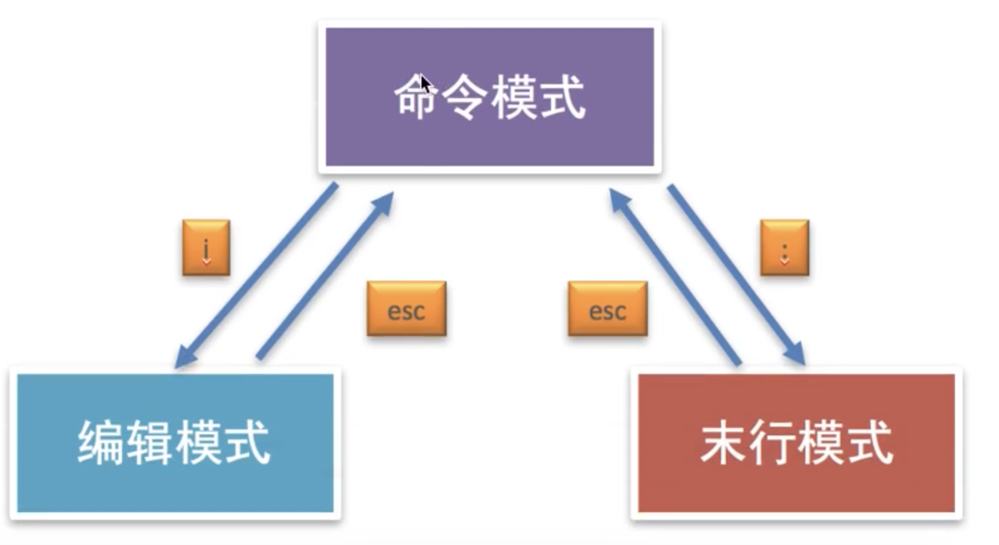

# vim

## 1 vim的工作模式
* 命令模式
* 编辑模式
* 末行模式

### 1.1 末行模式命令
* :w 保存
* :wq 保存退出
* :x 保存退出
* :q! 强制退出

### vim常用命令
命令|说明|备注
:--:|:--:|:--:
yy|复制光标所在行
p|粘贴（数字+p：粘贴多行）
dd|删除/剪切当前行
V|按行选中|V+G表示全选
u|撤销
ctr+r|反撤销
\>>|往右缩紧
\<<|往左缩紧
:/content|搜索指定内容，与通配符搭配|查找模式下可以用n来选择下一个，N选择上一个
:%s/要替换的内容/替换后的内容/g|全局替换|%表示整个文件，s表示替换，g表示全局替换
:开始行数,结束行数s/要替换的内容/替换后的内容|局部替换
.|重复上一次命令
G|回到最后一行
gg|回到第一行
数字+G|回到指定行
shift+6|回到当前行的行首
shift+4|回到当前行的末尾
ctr+f|下一屏
ctr+b|上一屏
