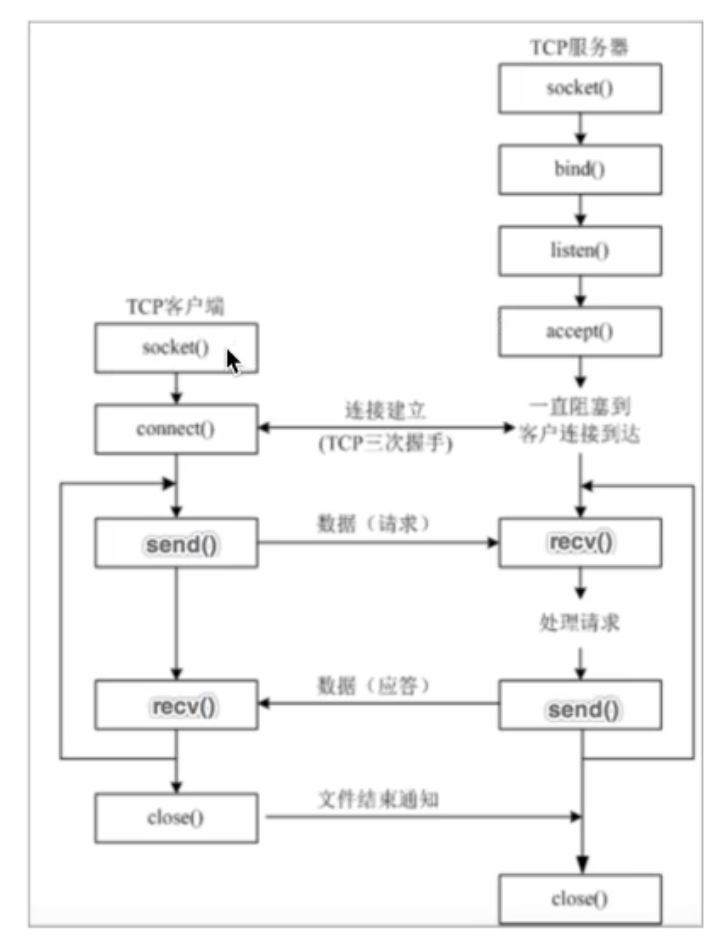

# 网络编程

## 1 IP地址
### 1.1 概念
网络通信时，首先通过IP地址找到需要通信的设备
* 标识网络中唯一一台设备的地址

### 1.2 查看IP地址
Linux/mac使用```ifconfig```命令，Windows使用```ipconfig```命令
**说明：**
* 192.168.1.107是设备在网络中的IP地址，是会变化的
* 127.0.0.1是本机地址，可以用于和本机通讯
* 127.0.0.1的域名是**localhost**，域名是IP地址的别名，通过域名可以解析出IP地址。

### 1.3 检查网络是否正常
常用```ping```命令
* ```ping 域名```检查是否能上公网
* ```ping 当前局域网的IP地址```检查是否在同一局域网
* ```ping 127.0.0.1```检查本地网卡是否正常


## 2 端口和端口号

### 2.1 概念
网络通信时，通过IP地址找到需要通信的设备，接下来要找到目标应用程序，及进程来发送数据，需要端口。
* 每运行一个网络程序都会有一个**端口**，想要给程序发送数据，需要找到对应的端口。每个端口就有一个对应的**端口号**。
* 程序之间通信的流程：先找到IP地址，在找到对应程序的端口号。
* 端口号是由操作系统命名的。端口号有65536个

### 2.2 端口号的分类
* 知名端口号：范围0-1023，例如21（FTP，文件传输协议），25（SMTP，简单邮件传输协议），80（HTTP协议）
* 动态端口号：程序员开发程序时使用的端口号，范围是1024-65535
  * 如果开发时没有设置端口号，操作系统会在使用时随机分配一个端口号
  * 运行一个程序默认有一个端口号，程序退出时，端口号被释放

## 3 TCP介绍
### 3.1 概念
网络通信时，有了IP地址和端口号找到要传输数据的进程之后，准备传输数据，但数据不能随便传递，需要遵循传输协议，保证程序间按照指定的规则传输数据。
* TCP（Transmission Control Protocol）简称**传输控制协议**，是一种面向连接的、可靠的、基于字节流的传输层通信协议。
* TCP通信步骤：
  1. 创建连接
  2. 传输数据
  3. 关闭连接

### 3.2 TCP的特点
1. 面向连接：通信双方必须要建立连接才能进行数据的传输；通信完成后，双方必须断开连接以释放资源。
2. 可靠传输：
   * TCP采用发送应答机制
   * 超时重传
   * 错误校验
   * 流量控制和阻塞管理

注：发送广播的程序，采用UDP协议（不可靠的传输协议）

## 4 Socket（套接字）
### 4.1 概念
网络通信时，IP地址确定哪一台设备，端口号确定哪一个进程，TCP协议规定了数据传输的规则。数据则是通过Socket来传输的。
* 进程之间通信的工具，类似于插座。


## 5 TCP网络应用程序开发流程
### 5.1 流程介绍

#### （1）TCP客户端程序开发
* 客户端程序是指运行在用户设备上的程序
* 流程说明：
  1. 创建客户端套接字对象
  2. 和服务端套接字建立连接
  3. 发送数据
  4. 接收数据
  5. 关闭客户端套接字
#### （2）TCP服务端程序开发
* 服务端程序是指运行在服务器设备上的程序，为客户端提供数据服务
* 流程说明：
  1. 创建服务端套接字对象
  2. 绑定端口号
  3. 设置监听
  4. 等待接受客户端的连接请求
  5. 接收数据
  6. 发送数据
  7. 关闭套接字

## 5 Python中实现TCP网络应用程序开发
### 5.1 TCP客户端程序开发
* ```socket```类介绍：
```python
import socket

s = socket.socket(AddressFamily, Type)
```
**参数说明：**
    * ```AddressFamily```表示IP地址类型，分为IPv4和IPv6
    * ```Type```表示传输类型协议
**方法说明：**
    * ```connect(host, port)```表示和服务端套接字建立连接，host时服务器IP地址，port是应用程序的端口号
    * ```send(data)```表示发送数据，data是二进制数据
    * ```recv(buffersize)```表示接收数据，buffersize表示每次接收数据的最大长度
* 例子：
```python

```

### 5.2 TCP服务端程序开发
**方法说明：**
    * ```bind(host, port)```表示绑定端口号，host时服务器IP地址，port是应用程序的端口号。IP地址一般不指定，表示本机的任何一个IP地址都可以（服务器上可能有多个网卡）。
    * ```listen(backlog)```表示设置监听，backlog表示最大等待建立连接的个数
    * ```accept()```表示等待接收客户端的连接请求
    * ```send(data)```表示发送数据，data是二进制数据
    * ```recv(buffersize)```表示接收数据，buffersize表示每次接收数据的最大长度

### 5.3 TCP服务端端口号复用
**说明：**
当客户端和服务端建立连接后，**服务端程序退出后端口号不会立即释放，需要等待1-2分钟**，可以通过以下两种方法解决：
* 更换服务器端口号
* 设置端口号复用，即让服务端程序退出后立即释放端口号
```python
tcp_server_socket.setsockopt(socket.SOL_SOCKET, # 当前套接字
                             socket.SO_REUSEADDR,   # 设置端口号复用选项
                             True   #设置端口号复用选项对应的值
                             )
```

### 5.4 TCP程序开发注意点
* TCP客户端（client）程序一般不需要绑定端口号，因为客户端是主动发起连接的。
* TCP服务端（server）程序必须绑定端口号。
* 调用```listen()```后的套接字变成了被动套接字（相当于10086），**只负责接收新客户端的连接请求，不能收发数据**，收发套接字需要用新的套接字（相当于10086的客服），这个新的套接字专门用于跟客户端收发数据。
* 将```accept()```返回的新套接字（相当于客服）关闭后，意味着服务端与这个客户端的通信结束了。
* 关闭调用```listen()```后的套接字（相当于10086）之后，意味着服务端的套接字关闭了，导致新的客户端不能连接服务端了，但之前连接成功的客户端还能正常通信。
* 当客户端调用```close()```之后，服务端的```recv()```会解阻塞，返回的数据长度为0，服务端可以根据返回数据的长度来判断用户是否已经下线。如果服务端关闭套接字，客户端的```recv()```也会解阻塞，返回的数据长度也为0。

### 5.5 多任务版TCP服务端
```python
```

### 5.6 ```send```和```recv```
* 发送数据是把数据发送到发送缓冲区
* 接收数据是从接收缓冲区获取


