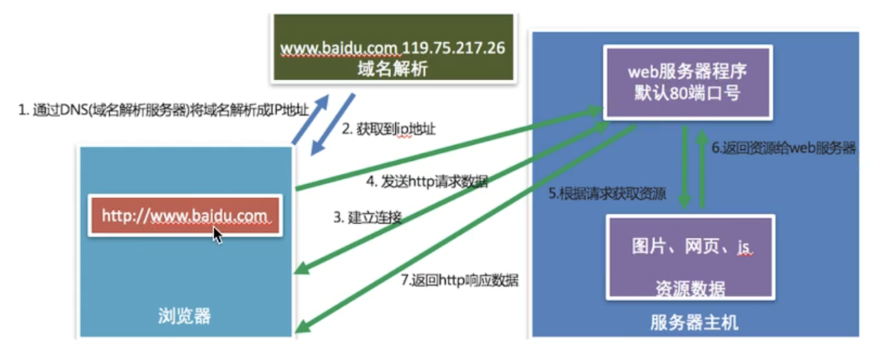
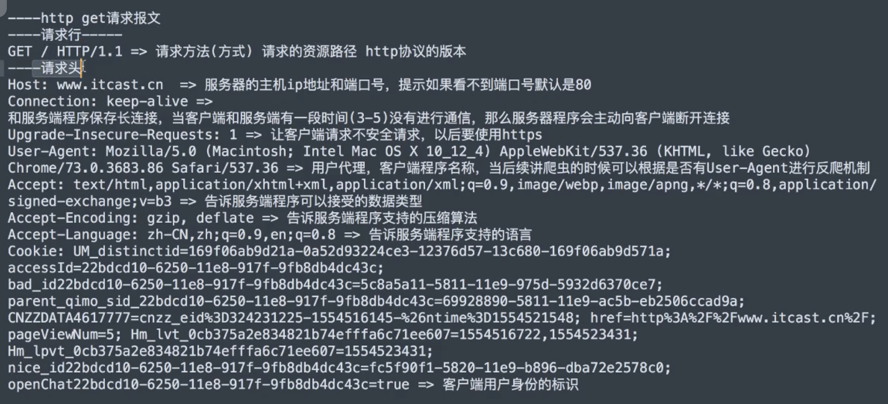
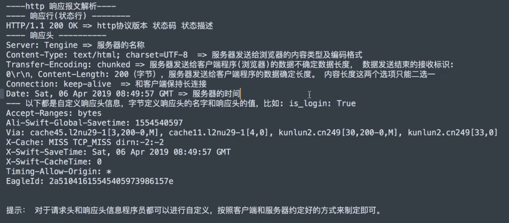

# HTTP协议

## 1 简介
* 规定了浏览器和web服务器通信的数据格式
* 通信效果图：


## 2 URL（Uniform Resource Locator）网址
### 2.1 组成部分
* 协议部分：https://, http://, ftp://
* 域名部分：news.163.com
* 资源路径部分
注：http:// 是明文传递，端口号为80 ；https:// 会对数据进行加密，端口号为443。

### 2.2 URL的扩展
https://news.163.com/hello.html?page=1&count=10
```?```后面为查询参数，参数之间用```&```分隔

## 3 HTTP请求报文：浏览器发送给web服务器的数据
### 3.1 介绍
HTTP最常见的请求报文有两种：
* GET方式的请求报文：获取web服务器数据
* POST方式的请求报文：向web服务器提交数据

### 3.2 GET请求报文分析
* 请求行\r\n
* 请求头\r\n
* 空行(\r\n)


### 3.3 POST请求报文分析
* 请求行\r\n
* 请求头\r\n
* 空行(\r\n)
* 请求体
注：请求体就是浏览器给web服务器发送的数据

### 3.4 请求行的组成
* 请求方式
* 请求资源路径
* HTTP协议版本


## 4 HTTP响应报文：web服务器发送给浏览器的http协议的数据
### 4.1 响应报文


### 4.2 HTTP状态码
用于表示web服务器响应状态的3位数字代码
状态码|说明
:--:|:--:
200|请求成功
307|重定向
400|错误的请求，请求地址或参数有误
404|请求资源在服务器不存在
500|服务器内部源代码出现错误