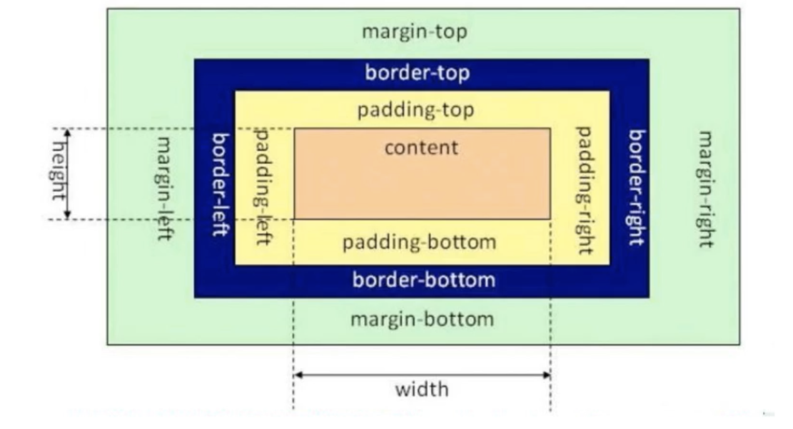

# CSS（Cascading Style Sheet）层叠样式表

## 1 CSS的引入方式
* 行内式
```html
<div style="width:100px; height:100px; background:red">hello</div>
```
行内式缺乏可重复性
* 内嵌式
在```<head>```标签内加入```<style>```标签，在```<style>```标签内写CSS代码
```html
<head>
    <style type="text/css">
        h3{
            color:red;
        } 
    </style>
</head>
```
内嵌式在多个页面中的可重复性不高
* 外链式
将css代码写在单独的.css文件中，在```<head>```标签中使用```<link>```标签直接引入该.css文件
```html
<link rel="stylesheet" type="text/css" href="css/main.css">
```

## 2 CSS选择器
css选择器就是用来选择html中的标签的，选出来以后再添加样式
* 标签选择器：以标签开头
```html
<style type="text/css">
    p{
        color:red;
    }
</style>

<div>hello</div>
<p>hi</p>
```
* 类选择器：以.开头
```html
<style type="text/css">
    .a{
        color:red;
    }
    .b{
        color:blue;
    }
</style>

<div>
    <p>hello</p>
</div>
<p class="b">hi</p>
```
* 层级选择器：根据层级关系选择后代选择器
```html
<style type="text/css">
    div p{
        color:red;
    }
    .con .pink{
        color:pink
    }
    .con .gold{
        color:gold
    }
</style>

<div>
    <p>hello</p>
</div>

<div class="con">
    <span>哈哈</span>
    <a href="www.baidu.com" class="pink">百度</a>
    <a href="www.google.com" class="gold">谷歌</a>
</div>
<span>你好</span>
<a href="www.sina.com" class="pink">新浪</a>
```
注：层级选择器不一定是父子关系，爷孙关系也可以

* id选择器：以#开头，id的名字不能重复

* 组选择器：多个选择器的组合，以逗号```,```分隔

* 伪类选择器：用于向选择器添加特殊效果，以```:```分开。例如当用户和网站交互时改变显示效果
```html
<style type="text/css">
    .box1{
        width:100px;
        height:100px;
        background:red;
    }
    .box1:hover{
        width:300px;
    }
</style>

<div class="box1">hello</div>
```

## 3 CSS常用样式属性
### 3.1 布局相关样式属性
属性|说明|备注
:--:|:--:|:--:
|```width```|
|```height```|
|```background```|元素背景色或背景图片|```background:gold; background:url(path);```
|```border```|元素四周的边框
|```border-top```|
|```border-left```|
|```border-right```|
|```border-bottom```|
|```padding```|设置元素包含的内容和元素边框的距离|也有```padding-top```等
|```margin```|元素与外界的距离|也有```margin-top```等
|```float```|设置元素浮动，浮动可以让块元素排列在一行|```float:left;```
### 3.2 文本相关样式属性
属性|说明|备注
:--:|:--:|:--:
|```color```|文字颜色|```color:red;```
|```font-size```|文字大小|```font-size:12px;```
|```font-family```|文字字体|```font-family:"Microsoft Yahei"```
|```font-weight```|文字是否加粗|```font-weight:bold; font-weight:normal```
|```font-height```|文字的行高
|```text-decoration```|设置文字的下划线|```text-decoration:none/underline/line-through/overline```
|```text-align```|文字水平对齐方式|```text-align:center/left/right```
|```text-indent```|文字首行缩进|```text-indent:30px```
注：```<span></span>```标签可以给一段文字中的一部分内容设置样式

### 3.3 CSS元素溢出
* 当子元素（标签）的尺寸超过父元素（标签）的尺寸时，需要设置父元素显示溢出的子元素的方式，通过```overflow```属性。
* ```overflow```的设置项：```visible```（默认值，显示溢出）；```hidden```（隐藏子标签溢出）；```auto``` （如果子标签溢出，可以滚动显示）。

### 3.4 CSS显示特性
* ```display```属性用来设置元素的类型及隐藏的。设置项包括：```none```（元素**隐藏**且**不占位置**）；```inline```（元素以行内元素显示，该属性不能与宽高一起设置，可以通过浮动来同时设置宽高和inline）；```block```（元素以块元素显示，即单独一行显示）。

## 4 盒子模型
将HTML页面的元素看作一个矩形盒子，由内容（content）、内边距（```padding```）、边框（```border```）、外边距（```margin```）组成。content可以设置```height```和```width```。

* 只有```margin```不会影响盒子的大小
