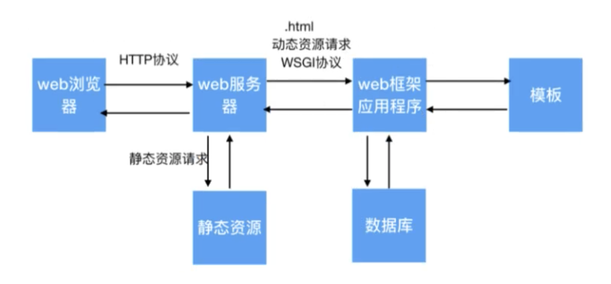

# mini-web框架

## 1 web框架概述


## 2 框架程序开发
* 接收web服务器的动态资源请求，给web服务器提供处理动态资源请求的服务。
* 思路：根据请求资源路径的后缀名进行判断
  * 如果请求资源路径的后缀名是.html则是动态资源请求, 让web框架程序进行处理。
  * 否则是静态资源请求，让web服务器程序进行处理。

* main.py:
```python
import socket
import threading
import sys

import framework

class HttpWebServer(object):
    def __init__(self, port):
        # 创建服务器套接字
        tcp_server_socket = socket.socket(socket.AF_INET, socket.SOCK_STREAM)
        # 设置端口号复用，程序退出后立即释放
        tcp_server_socket.setsockopt(socket.SOL_SOCKET, socket.SO_REUSEADDR, True)
        # 绑定端口号
        tcp_server_socket.bind(("", port))
        # 设置监听
        tcp_server_socket.listen(128)
        self.tcp_server_socket = tcp_server_socket
    
    # 处理客户的请求
    @staticmethod
    def handle_client_request(new_socket:socket.socket):
        recv_client_data = new_socket.recv(4096)
        # 判断用户是否离开
        if len(recv_client_data) == 0:
            print("关闭浏览器了")
            # 关闭服务与客户端的套接字
            new_socket.close()
            return
        
        # 对二进制数据进行解码
        recv_client_content = recv_client_data.decode("utf-8")
        print("请求报文：", recv_client_content)
        # 将请求报文进行字符串分割，目的是找到资源请求的路径
        request_list = recv_client_content.split(' ', maxsplit=2)
        
        # 获取资源请求的路径
        request_path = request_list[1]
        print("请求页面：", request_path)
        
        if request_path == "/":
            request_path = "/index.html"
        
        # TODO 判断是否为动态资源请求
        if request_path.endswith(".html"):
            """这里是动态资源请求，把请求信息交给web框架应用程序处理"""
            # 字典存储用户请求的信息
            env = {
                "request_path": request_path
            }
            
            # 获取处理结果
            status, headers, response_body = framework.handle_request(env)
            
            # 使用框架处理的数据拼接响应报文
            # 响应行
            response_line = "HTTP/1.1 %s\r\n" % status
            # 响应头
            response_header = ""
            # 遍历头部信息
            for header in headers:
                # 拼接多个响应头
                response_header += "%s: %s\r\n" % header
            response_data = (response_line +
                             response_header +
                             "\r\n" +
                             response_body).encode("utf-8")
            # 发送数据
            new_socket.send(response_data)
            # 关闭socket
            new_socket.close()
            
        else:
            """这里是静态资源请求，"""
            try:
                with open("static" + request_path, 'r') as f:
                    file_data = f.read()
            except Exception as e:
                # 请求资源不存在，返回404
                # 响应行
                response_line = "HTTP/1.1 404 Not Found\r\n"
                # 响应头
                response_head = "Server: PWS1.0\r\n"
                with open("static/error.html", 'r') as f:
                    file_data = f.read()
                # 响应体
                response_body = file_data
                
                # 拼接响应报文
                response_data = (response_line + response_head + "\r\n").encode("utf-8") \
                                + response_body
                # 发送数据
                new_socket.send(response_data)
            else:
                # 响应行
                response_line = "HTTP/1.1 200 OK\r\n"
                # 响应头
                response_head = "Server: PWS1.0\r\n"
                # 响应体
                response_body = file_data
                
                # 拼接响应报文
                response_data = (response_line + response_head + "\r\n").encode("utf-8") \
                                + response_body
                # 发送数据
                new_socket.send(response_data)
            finally:
                new_socket.close()
    
    def start(self):
        while True:
            new_socket, ip_port = self.tcp_server_socket.accept()
            sub_thread = threading.Thread(target=self.handle_client_request, args=(new_socket,))
            # 设置守护主线程
            sub_thread.setDaemon(True)
            sub_thread.start()

# 主函数需要确定web程序的端口号
def main():
    # 获取命令行参数判断长度
    if len(sys.argv) != 2:
        print("请输入如下指令：python3 xxx.py 9000")
        return
    
    # 判断端口号是否为数字
    if not sys.argv[1].isdigit():
        print("请输入如下指令：python3 xxx.py 9000")
        return
    
    # 将端口号转为int
    port = int(sys.argv[1])
    
    # 创建web服务器
    web_server = HttpWebServer(port)
    web_server.start()

if __name__ == '__main__':
    main()
```
* framework.py
```python
"""miniweb框架，负责处理动态资源请求"""
import time


# 获取首页数据
def index():
    # 响应状态
    status = "200 OK";
    # 响应头
    response_header = [("Server", "PWS2.0")]
    # 处理后的数据
    data = time.ctime()

    return status, response_header, data


# 没有找到动态资源
def not_found():
    # 响应状态
    status = "404 Not Found";
    # 响应头
    response_header = [("Server", "PWS2.0")]
    # 处理后的数据
    data = "not found"

    return status, response_header, data


# 处理动态资源请求
def handle_request(env):
    # 获取动态请求资源路径
    request_path = env["request_path"]
    print("接收到的动态资源请求:", request_path)

    if request_path == "/index.html":
        # 获取首页数据
        result = index()
        return result
    else:
        # 没有找到动态资源
        result = not_found()
        return result
```

## 3 模板功能替换
需要动态的替换html中的内容

## 4 路由功能
* 路由就是请求的URL到处理函数的映射，也就是说提前把请求的URL和处理函数关联好。
### 4.1 方法一：路由列表开发
framework.py示例代码
```python
# 定义路由列表
route_list = [
    ("/index.html", index),
    ("/center.html", center)
]

# 处理动态资源请求
def handle_request(env):
    # 获取动态请求资源路径
    request_path = env["request_path"]
    print("接收到的动态资源请求:", request_path)
    # 遍历路由列表，选择执行的函数
    for path, func in route_list:
        if request_path == path:
            result = func()
            return result
    else:
        # 没有找到动态资源
        result = not_found()
        return result

    # if request_path == "/index.html":
    #     # 获取首页数据
    #     result = index()
    #     return result
    # elif request_path == "/center.html":
    #     # 获取个人中心数据
    #     result = center()
    #     return result
    # else:
    #     # 没有找到动态资源
    #     result = not_found()
    #     return result
```
### 4.2 方法二：装饰器方法添加路由
```python
"""miniweb框架，负责处理动态资源请求"""
import time

# 定义路由列表
route_list = []


# 定义带有参数的装饰器
def route(path):
    # 装饰器
    def decorator(func):
        # 当执行装饰器装饰指定函数的时候，把路径和函数添加到路由列表
        route_list.append((path, func))

        def inner():
            # 执行指定函数
            return func()

        return inner
    # 返回装饰器
    return decorator


# 获取首页数据
@route("/index.html")
def index():
    # 响应状态
    status = "200 OK";
    # 响应头
    response_header = [("Server", "PWS2.0")]

    # 打开模板文件，读取数据
    with open("template/index.html", "r") as file:
        file_data = file.read()

    # 处理后的数据, 从数据库查询
    data = time.ctime()
    # 替换模板文件中的模板遍历
    result = file_data.replace("", data)

    return status, response_header, result


# 获取个人中心数据
@route("/center.html")
def center():
    # 响应状态
    status = "200 OK";
    # 响应头
    response_header = [("Server", "PWS2.0")]

    # 打开模板文件，读取数据
    with open("template/center.html", "r") as file:
        file_data = file.read()

    # 处理后的数据, 从数据库查询
    data = time.ctime()
    # 替换模板文件中的模板遍历
    result = file_data.replace("", data)

    return status, response_header, result


# 没有找到动态资源
def not_found():
    # 响应状态
    status = "404 Not Found";
    # 响应头
    response_header = [("Server", "PWS2.0")]
    # 处理后的数据
    data = "not found"

    return status, response_header, data


# 处理动态资源请求
def handle_request(env):
    # 获取动态请求资源路径
    request_path = env["request_path"]
    print("接收到的动态资源请求:", request_path)
    # 遍历路由列表，选择执行的函数
    for path, func in route_list:
        if request_path == path:
            result = func()
            return result
    else:
        # 没有找到动态资源
        result = not_found()
        return result
```
* 模块执行的时候，执行了装饰器，会自动将路由添加到路由列表

## 5 查询数据库数据替换模板
* 示例1：
```python
# 获取首页数据
@route("/index.html")
def index():
    # 响应状态
    status = "200 OK";
    # 响应头
    response_header = [("Server", "PWS2.0")]

    # 打开模板文件，读取数据
    with open("template/index.html", "r") as file:
        file_data = file.read()

    # 处理后的数据, 从数据库查询
    conn = pymysql.connect(host="localhost",
                           port=3306,
                           user="root",
                           password="mysql",
                           database="stock_db",
                           charset="utf8")

    # 获取游标
    cursor = conn.cursor()
    # 查询sql语句
    sql = "select * from info;"
    # 执行sql
    cursor.execute(sql)
    # 获取结果集
    result = cursor.fetchall()
    print(result)

    data = ""
    for row in result:
        data += '''<tr>
                    <td>%s</td>
                    <td>%s</td>
                    <td>%s</td>
                    <td>%s</td>
                    <td>%s</td>
                    <td>%s</td>
                    <td>%s</td>
                    <td>%s</td>
                    <td><input type="button" value="添加" id="toAdd" name="toAdd" systemidvaule="000007"></td>
                   </tr>''' % row

    # 替换模板文件中的模板遍历
    result = file_data.replace("", data)

    return status, response_header, result
```
* 示例2：查询个人页面数据，转化为json数据格式
```python
# 个人中心数据接口开发
@route("/center_data.html")
def center_data():
    # 响应状态
    status = "200 OK";
    # 响应头
    response_header = [("Server", "PWS2.0"), ("Content-Type", "text/html;charset=utf-8")]
    conn = pymysql.connect(host="localhost",
                           port=3306,
                           user="root",
                           password="mysql",
                           database="stock_db",
                           charset="utf8")

    # 获取游标
    cursor = conn.cursor()
    # 查询sql语句
    sql = '''select i.code, i.short, i.chg, 
             i.turnover, i.price, i.highs, f.note_info 
             from info as i inner join focus as f on i.id = f.info_id;'''
    # 执行sql
    cursor.execute(sql)
    # 获取结果集
    result = cursor.fetchall()
    # 关闭游标
    cursor.close()
    # 关闭数据库连接
    conn.close()
    # 个人中心数据列表
    center_data_list = list()
    # 遍历每一行数据转成字典
    for row in result:
        # 创建空的字典
        center_dict = dict()
        center_dict["code"] = row[0]
        center_dict["short"] = row[1]
        center_dict["chg"] = row[2]
        center_dict["turnover"] = row[3]
        center_dict["price"] = str(row[4])
        center_dict["highs"] = str(row[5])
        center_dict["note_info"] = row[6]
        # 添加每个字典信息
        center_data_list.append(center_dict)

    # 把列表字典转成json字符串, 并在控制台显示
    json_str = json.dumps(center_data_list,ensure_ascii=False)
    print(json_str)
    return status, response_header, json_str
```
ajax渲染：
```javascript
// 发送ajax请求获取个人中心页面数据
$.get("center_data.html", function (data) {

    var data_array = data;

    // 获取table标签对象
    var $table = $(".table")
    for(var i = 0; i < data_array.length; i++){
        // 获取每一条对象
        var center_obj = data_array[i];
        var row_html = '<tr>' +
            '<td>'+ center_obj.code +'</td>' +
            '<td>'+ center_obj.short +'</td>' +
            '<td>'+ center_obj.chg +'</td>' +
            '<td>'+ center_obj.turnover +'</td>' +
            '<td>'+ center_obj.price +'</td>' +
            '<td>'+ center_obj.highs +'</td>' +
            '<td>'+ center_obj.note_info +'</td>' +
            '<td><a type="button" class="btn btn-default btn-xs" href="/update/000007.html"> <span class="glyphicon glyphicon-star" aria-hidden="true"></span> 修改 </a></td><td><input type="button" value="删除" id="toDel" name="toDel" systemidvaule="000007"></td></tr>';
        // 为table标签添加每一行组装的html数据
        $table.append(row_html);
    }

}, "json");
```

