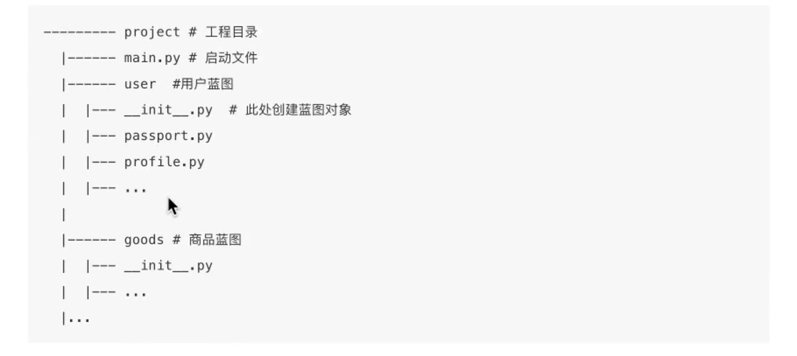

# 路由与蓝图

## 1 路由
### 1.1 查询路由
* 命令行：`flask routes`
* 属性访问：`app.url_map`
  * 遍历url_map：
```python
for rule in app.url_map.iter_rules():
    print("name={}, path={}".format(rule.endpoint, rule.rule))
```

### 1.2 指定请求方式
* Flask中默认的请求方式为：
  * GET
  * OPTIONS（自带）=> 简化版的GET请求，用于询问服务器接口信息。
  * HEAD（自带）=> 简化版的GET请求，只返回GET请求处理时的响应头，不返回响应体。

* 设置自定请求方式：`methods`参数
  * 包括的参数：POST，DELETE等

## 2 蓝图
存储一组视图方法的容器对象，有如下特点：
* 一个应用可以有多个Blueprint。
* 可以将一个Blueprint注册到任何一个未使用的URL比如"/users","/goods"。
* Blueprint可以单独具有自己的模板、静态文件或其他通用的操作方法，并不需要实现应用的视图和函数。
* 在一个应用初始化时，就应该要注册需要使用的Blueprint。
### 2.1 使用方式
#### （1）在文件中使用
```python
from flask import Blueprint, Flask

app = Flask(__name__, static_folder="static_files")

# 1. 创建一个蓝图对象
user_bp = Blueprint("user", __name__) 
# 2. 在蓝图对象上进行操作：注册路由，指定静态文件夹，注册模板过滤器
@user_bp.route('/profile')
def user_profile():
    return "user_profile"
# 3. 在应用对象上注册这个蓝图对象
app.register_blueprint(user_bp) # 可以通过url_prefix参数类设置蓝图的url访问前缀
```


#### （2）在目录中使用

