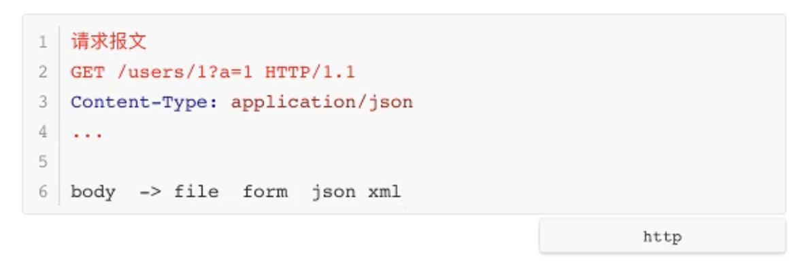
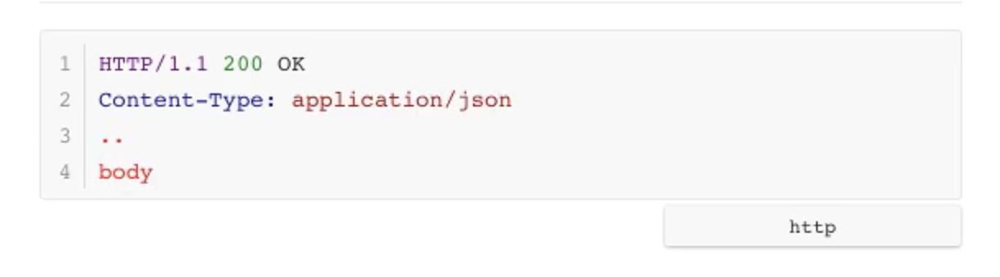

<!-- 让表格居中显示的风格 -->
<style>
.center{
    width: auto;
    display: table;
    margin-left: auto;
    margin-right: auto;
}
</style>


# 请求和响应

## 1 url获取路径参数
### 1.1 转换器方法获取


* 需求：有一个请求访问的接口地址为`/users/123`，123实际上为具体的请求参数表示用户的信息，此时如何从url中提取123呢？

Flask不同于Django直接在定义路由时用正则表达式的方式，而是采用转换器法：
```python
# <>为转换器，默认为字符串类型，即将该位置的数据以字符串的形式进行匹配
@app.route('/users/<user_id>')
def use_info(user_id):
    print(type(user_id))
    return 'hello user {}'.format(user_id)

# 指定匹配的类型
@app.route('/users/<int:user_id>')
def use_info(user_id):
    return 'hello user {}'.format(user_id)
```
Flask提供的转换器类型：
```python
DEFAULT_CONVERTERS = {
    'default':  UnicodeConverter,
    'string' :  UnicodeConverter,
    'any':      AnyConverter,       # 在可选范围内取
    'path':     PathConverter,  
    'int':      IntegetConverter,
    'float':    FloatConverter,
    'uuid':     UUIDConverter,
}
```

### 1.2 自制转换器
* 需求：匹配/sms_codes/17012340000中的手机号数据，需要自定义转换器

```python
from flask import Flask
from werkzeug.routing import BaseConverter

# 1. 需要封装到类中，并用类属性表示
class MobileConverter(BaseConverter):
    """
    匹配手机号格式
    """
    regex = r'1[3-9]\d{9}'  # regex名字固定

# 2. 将自定义转换器告知Flask
app = Flask(__name__)
app.url_map.converters['mobile'] = MobileConverter

@app.route('/sms_codes/<mobile:mob_num>')
def send_sms_code(mob_num):
    print(type(mob_num))
    return 'send sms to {}'.format(mob_num)
```

## 2 处理其他参数
如果想要获取其他地方传递的参数，可以使用Flask提供的`request`对象。不同位置的参数需要`request`对象的不同属性。
<div class='center'>

属性|说明|类型
:--:|:--:|:--:
`data`|记录请求的数据，并转化为字符串|*
`form`|记录请求中的表单数据|MultiDict
`args`|记录请求中的查询参数|MultiDict
`cookies`|记录请求中的cookie信息|Dict
`headers`|记录请求中的报文头|EnvironHeaders
`method`|记录请求使用的http方法|GET/POST
`url`|记录请求url地址|string
`files`|记录请求的上传文件|*

</div>

* 需求1：想要获取请求 `/articles?channel_id=1` 中`channel_id`的参数
```python
from flask import request

@app.route('/articles')
def get_articles():
    channel_id = request.args.get('channel_id')
    return 'You wanna get article of channel {}'.format(channel_id)
```

* 需求2：客户端上传的图片文件，保存到服务器
```python
from flask import request

@app.route('/upload', method=['POST'])
def upload_file():
    f = request.files['pic']    # 返回的是文件对象，而不是原始的二进制数据文件
    # with open('./demo.png', 'wb') as new_file:    # 写文件的常规方法
    #     new_file.write(f.read())
    f.save('./demo.png')    # 提供的新方法
    return 'OK'
```

## 3 处理响应
### 3.1 返回模板
如何在不同的场景返回不同的响应信息

例如新建一个模板`index.html`
```html
<!DOCTYPE html>
<html lang="en">
<head>
    <meta charset='utf-8'>
    <title>Title</title>
</head>
<body>
我的模板内容
<br/>{{ my_str }}    
<br/>{{ my_int }}
</body>
</html>
```
后端渲染1：
```python
from flask import Flask, render_template

app = Flask(__name__)

@app.route('/')
def home():
    mstr = 'yubowen'
    mint = 2020
    return render_template('index.html', my_str=mint, my_int=mint)  # 参数形式传递
```
后端渲染2：
```python
from flask import Flask, render_template

app = Flask(__name__)

@app.route('/')
def home():
    data = {
        my_str = 'yubowen'
        my_int = 2020
    }
    return render_template('index.html', **data)
```

### 3.2 重定向
```python
from flask import redirect

@app.route('/redirect')
def redirect():
    return redirect('www.baidu.com')

```

### 3.3 返回JSON
在响应报文的body部分返回json数据
* 方法1：常规方法
```python
import json

return json.dumps({})
```
* 方法2：Flask提供的方法
```python
from flask import jsonify

@app.route('/')
def home():
    json_dict = {
        "user_id": 10,
        "user_name": "Naruto",
    }
    return jsonify(json_dict)
```
`jsonify()`相比`json.dumps()`，额外实现了：设置了响应头`Content-Type:application/json`

### 3.4 自定义状态码和响应头
#### （1）元组方式
返回一个元组，形式为`(response, status, headers)`，至少包含一个元素。
* response：响应体body部分
* status：状态码，值会覆盖状态代码
* headers：响应头，可以是一个列表或字典，作为额外的消息标头值。
```python
@app.route('/')
def home():
    # return 'make response test', 666, [('Baidu', 'Python'),] # 响应头方法1
    return 'make response test', 666, {'Baidu': 'Python'}   # 响应头方法2
```

#### （2）`make_response`方式
```python
from flask import Flask, make_response

@app.route('/')
def home():
    resp = make_response('make response test')  # 响应体body部分
    resp.headers['Baidu'] = 'Python'   # 响应头
    resp.status = '404 not found'   # 状态码
    return resp
```

## 4 Cookie
```python
from flask import Flask, make_response

app = Flask(__name__)

@app.route('/cookie')
def set_cookie():
    # 1. 需要通过响应对象来设置Cookie
    resp = make_response('set cookie ok')
    resp.set_cookie('username', 'Baidu', max_age=3600)  # 通过max_age参数来设置有效期
    return resp

# 2. 获取cookie
@app.route('/get_cookie')
def get_cookie():
    resp = request.cookies.get("username")
    return resp

# 3. 删除cookie，本质上是设置了生命周期
@app.route('/delete_cookie')
def delete_cookie():
    resp = make_response("hello world")
    resp.delete_cookie("username")
    return resp
```

## 5 Session
```python
from flask import Flask

class DefaultConfig(object):
    SECRET_KEY = "1223445"

app = Flask(__name__)

# 1. 需要先设置SECRET_KEY
# app.config.from_object(DefaultConfig) # 方法1
app.secret_key = "1223445"  # 方法2 

# 2. 设置
@app.route('/set_session')
def set_session():
    session['username'] = 'Baidu'
    return 'set session ok'

# 3. 读取
@app.route('/get_session')
def get_session():
    username = session.get('username')
    return 'get user name {}'.format(username) 
```
思考：flask将Session放在哪了？放到了浏览器的缓存里面，即浏览器Session，而不是放到Redis里面，因此需要secret_key。