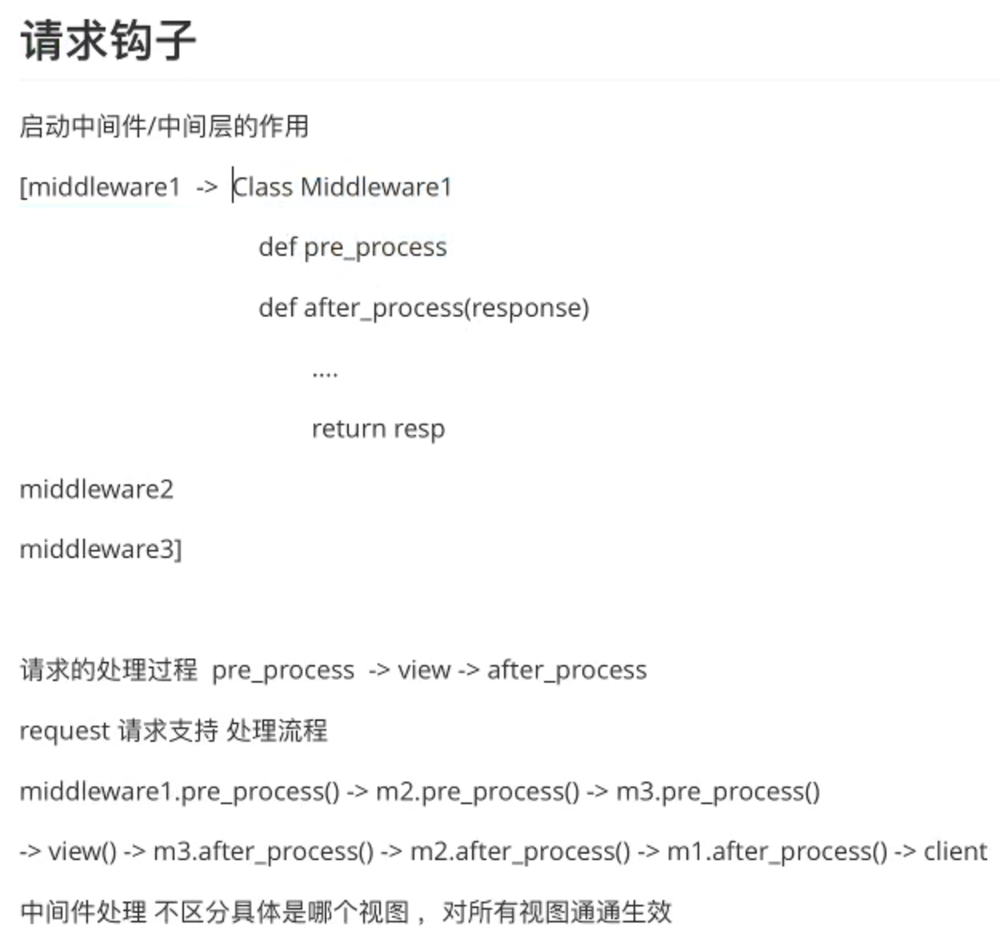

# 请求钩子和上下文
## 1 异常处理
### 1.1 HTTP异常主动抛出
`abort`方法：拋出一个给定状态代码的`HTTPException`或者指定响应，例如想要用一个页面未找到异常来终止请求，你可以调用`abort(404)`。参数为状态码`code`，只能是HTTP协议的错误状态码。

### 1.2 捕获错误
* `errorhandler`装饰器：注册一个错误处理程序，当程序抛出指定错误状态码的时候，就会调用该装饰器所装饰的方法
```python
@app.errorhandler(500)
def internal_server_error():
    return '服务器搬家了'
```
* 捕获指定异常
```python
@app.errorhandler(ZeroDivisionError)
def zero_division_error():
    return '除数不能为0'
```

## 2 请求钩子
请求的处理过程：pre_process -> view -> after_process

flask中请求钩子通过装饰器来实现，起到中间件的作用，有四种。
<div class='center'>

装饰器|说明
:--:|:--:
`before_first_request`|在处理第一个请求前执行
`before_request`|每次请求前执行；<br>如果某修饰函数返回了一个响应，视图函数将不会再被调用。
`after_request`|如果没有抛出错误，在每次请求后执行；<br>参数：视图函数的响应；<br>可以对返回值在响应前进行修改；<br>需要将参数中的响应在此参数中返回。
`teardown_request`|每次请求后执行；<br>参数：错误信息，如果有相关错误抛出。

</div>

```python
from flask import Flask

app = Flask(__name__)

# 在第一次请求之前调用，可以在该方法内部做一些初始化操作
@app.before_first_request
def before_first_request():
    print("before first request")

# 在每一次请求之前调用，此时可能已经有过请求了，可以在该方法中做一些请求的校验
# 如果请求的校验不成功，可以直接在此方法中进行响应，return之后就不会执行视图函数了
@app.before_request
def before_request():
    print("before request")

# 执行完view函数后调用，并且将视图函数生成的响应response传入
@app.after_request
def after_request(response):
    print("after request")
    response.headers['Content-Type'] = 'application/json'
    return response

# 每一次请求之后都会调用，参数是服务器出现的错误信息
@app.teardown_request
def teardown_request(response):
    print("teardown request")

@app.route('/')
def index():
    print('view called')
    return 'index'
```

## 3 上下文
* 思考：request在使用的时候是全局变量，但为什么多个用户访问的时候会处理不同的数据？原因是flask的request是一种上下文（语境）对象。
* flask中有两种上下文：请求上下文，应用上下文
### 3.1 请求上下文（request context）
在flask中，可以直接在视图函数中使用**request**对象进行获取相关数据，这个对象保存了本次请求的相关数据。
* `request`：封装了http请求的内容。例如`user = request.args.get('user')`
* `session`：记录请求会话中的信息，针对的是用户信息。例如`session['name'] = user.id`和`session.get('name')`

### 3.2 应用上下文（application context）
不是一直存在的，只是request context中的一个对app的代理。主要作用是帮助request获取当前对象。（由于在多文件的时候，子文件中不方便获得全局的app）
* `current_app`：应用程序上下文，用于存储应用程序中的变量，可以通过`current_app.name`打印当前app的名称，也可以在`current_app`中存储一些变量，例如
  * 应用程序的启动脚本是哪一个文件，启动时执行了哪些参数
  * 加载了哪些配置文件，导入了哪些设置
  * 连了哪个数据库
  * 有哪些public的工具类、常量
  * 应用跑在哪个机器上，IP多少，内存多大
`current_app`就是当前运行的flask app，在代码不方便直接操作flask的app对象时，可以操作`current_app`就等价于操作flask app对象
* `g`对象：g作为 flask 程序全局的一个临时变量，充当中间媒介的作用，我们可以通过它在一次请求调用的多个函数间传递一些数据。每次请求都会重设这个变量。
```python
from flask import Flask, g

app = Flask(__name__)

# 假设该方法为数据库查询
def db_query():
    uid = g.user_id
    uname = g.user_name
    print('user_id={}, user_name={}'.format(uid, uname))    # 

@app.route('/')
def get_user_profile():
    g.user_id = 123 # 修改g对象
    g.user_name = 'yubowen'
    db_query()
    return 'hello world'

```

## 3.3 上下文实现的原理 -> Threadlocal（线程局部变量）


## 4 综合案例
判断用户的身份，如果已注册，则放行；反之抛出错误。
```python
from flask import Flask, abort, g

app = Flask(__name__)

@app.before_request
def authenticate():
    # 在进入所有视图之前，判断用户身份
    # g.user_id = 123 # 将用户信息存在g对象中
    g.user_id = None

# 强制登陆装饰器
def login_required(func):
    
    def wrapper(*args, **kwargs):
        # 判断用户是否登陆
        if g.user_id is None:
            abort(401)
        else:
            return func(*args, **kwargs)
    
    return wrapper

@app.route('/')
def index():
    return 'home page user_id={}'.format(g.user_id)

@app.route('/profile')
@login_required
def get_user_profile():
    return 'user profile page user_id={}'.format(g.user_id)

if __name__ == '__main__':
    app.run()
```
