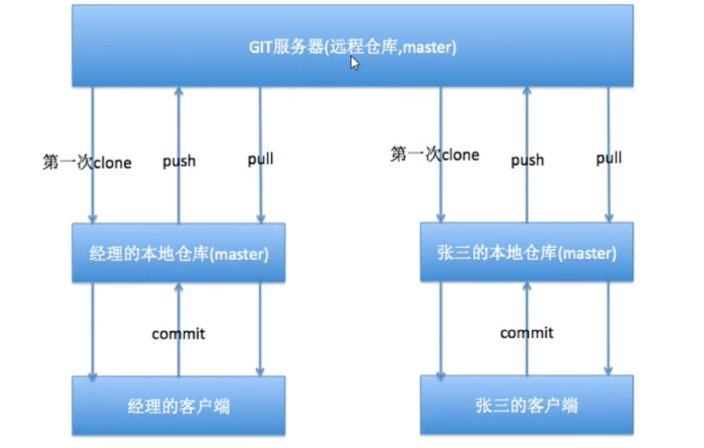
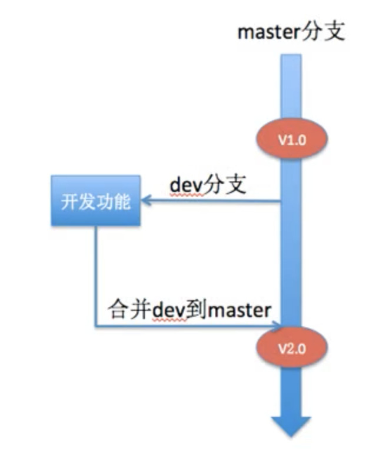

<!-- 让表格居中显示的风格 -->

# Git远程仓库

## 1 远程仓库使用

指令|说明|拓展
:--:|:--:|:--:
|`git pull`
|`git push`|
|`git clone`|

## 2 多人协作

## 3 冲突
多人同时修改了一个文件。（指修改了同一行）

## 4 标签
当一个大版本完成后，需要打一个标签，方便查看和回退

指令|说明|拓展
:--:|:--:|:--:
|`git tag -a v1.0 -m 'version1.0'`|本地打标签v1.0
|`git tag`|查看标签
|`git push origin v1.0`|推送标签到远程仓库（origin就是remote）
|`git tag -d v1.0`|删除本地
|`git push --delete origin v1.0`|删除远程tag

## 5 分支

指令|说明|拓展
:--:|:--:|:--:
|`git branch`|查看分支
|`git checkout -b branch_name`|创建并切换到该分支
|`git checkout branch_name`|切换分支
|`git merge branch_name`|在master主分支合并其他分支

